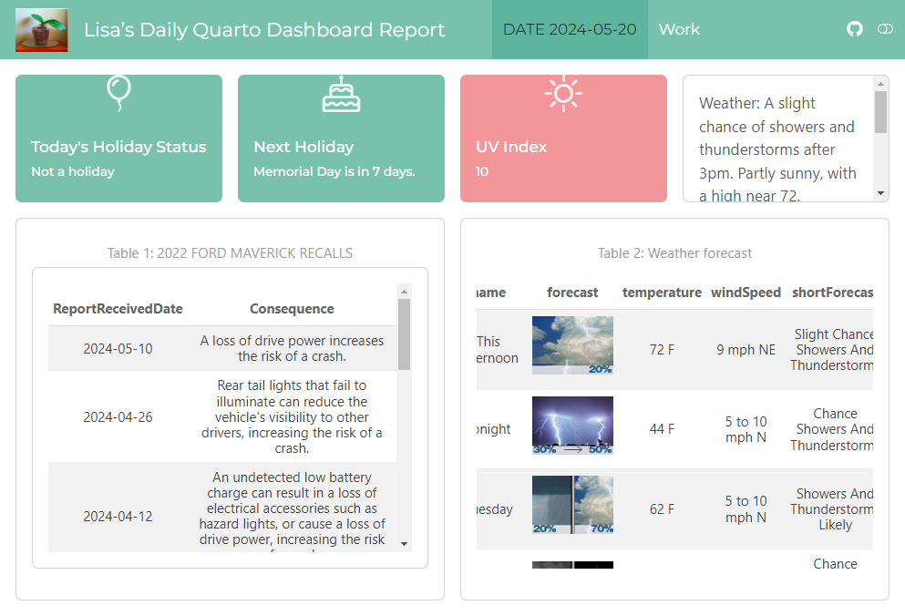

# Landing Page

Preview with: `quarto preview index.qmd --to default --no-watch-inputs --no-browse`

# Bells and Whistles

## Programmatically generating widget content

The data for each of the content widgets is being pulled from the Connect server using the Connect API. We can then use the details to generate the different titles, links, and references. For example, filtering down to the `dashboard` item: 

````markdown
**`{r} all_content[all_content$name =="dashboard",]$title`**

{fig-align="center" width=200}

<a href="`r all_content[all_content$name =="dashboard",]$dashboard_url`" class="stretched-link"></a>
````

### More complex example 

All sorts of layout content can be programmatically generated. For example like this, in order to programmatically create tabs and contents: 

````markdown

## Programmatic generation

### Minimal example

```{r}
library(tidyverse)

languages <- c("R", "Python")
sections <- c("Static Documents", "Interactive Applications", "API's", "Pins")
text <- c("hello")
```

#### tabs

:::: {.column-body}
::: {.panel-tabset}
```{r}
#| results: asis
#| fig-width: 14
#| fig-height: 6

iwalk(languages, ~ {
  cat('#### ', .y, '\n\n')

  print(paste0(text, collapse = ""))

  cat('\n\n')

})
```

:::
::::
````

## Embedding a presentation

In order to successfully embed the presentation, the presentation html needs to be self-contained and also located within the directory of the home landing page: 

```
format:
  positslides-revealjs: 
    embed-resources: true
```

Note that the chalkboard feature can't be included when self-contained. 

# For the developer

## Resources

- Custom dashboard with connectwidgets: <https://docs.posit.co/connect/how-to/connectwidgets/index.html#a-custom-dashboard>
- Auditing and monitoring Connect with the Connect server API: <https://solutions.posit.co/operations/connect-apis/index.html>
- Custom landing page: <https://docs.posit.co/connect/admin/appendix/custom-landing/index.html#custom-landing-page-assets>
- User guide how-to for tracking visits to shiny apps: <https://docs.posit.co/connect/user/shiny/index.html#shiny-visits>
- User guide tracking visits: <https://docs.posit.co/connect/user/usage-data/index.html>
- RMarkdown tracking visits: <https://docs.posit.co/connect/user/rmarkdown/index.html#r-markdown-visits>

## Examples:

- Ryan's Posit Training Home Page: <https://github.com/ryjohnson09/Posit-Training-Home-Page>
- Posit Connect Display Case: <https://colorado.posit.co/rsc/connect/#/apps/87182afc-6ac0-4b6b-abf4-eba9cd2eea3e/access/6120>
- Bike share python landing page: <https://colorado.posit.co/rsc/connect/#/apps/70a3d7b5-bdc3-4970-b991-fc1059b3998f/access/5509>
- Lisa's developer landing page: <https://colorado.posit.co/rsc/connect/#/apps/6f9e3bb7-d345-4932-b943-896586659f66/access/5496>
- And another one: <https://colorado.posit.co/rsc/connect/#/apps/23a7e1a3-fcbe-4efe-aea9-585198de6064/access>
- The Colorado landing page: <https://colorado.posit.co/rsc/connect/#/apps/b9f39220-daf8-4a3c-b698-389991f98724/access>
- Healthcare Shiny Showcase landing page: <https://github.com/posit-dev/healthcare-shiny-showcase/tree/main> 

## Preview

```
quarto preview content.qmd --to default --no-watch-inputs --no-browse
```

## Set the API keys

Follow this: <https://docs.posit.co/connect/how-to/connectwidgets/index.html#api-keys>

Reference this example: <https://github.com/rstudio/actions/tree/main/connect-publish#update-env> 

We want to set this up so that the environment variable is attached when deploying to the server. 

Alternatively, could try pulling from the github environment and setting with rsconnect. In order to pull that into the script for the landing page we can follow this: <https://canovasjm.netlify.app/2021/01/12/github-secrets-from-python-and-r/> 

They are named: 

- CONNECT_API_KEY
- CONNECT_URL


Needs work: 

```
  notify:
    needs: connect-publish-dashboard
    runs-on: ubuntu-latest
    name: connect-publish-landing-page
    steps:
      - uses: actions/checkout@v3
      - uses: r-lib/actions/setup-pandoc@v2
      - uses: r-lib/actions/setup-r@v2
        with:
          r-version: 4.2.0
          use-public-rspm: true
      - uses: r-lib/actions/setup-renv@v2
      # - name: Create manifest.json
      #     shell: Rscript {0}
      #     run: |
      #       rsconnect::writeManifest()
      - name: Publish the app to Connect
      - uses: rstudio/actions/connect-publish@main
        with:
          url: ${{ secrets.CONNECT_URL }}
          api-key: ${{ secrets.CONNECT_API_KEY }}
          access-type: logged_in
          show-logs: TRUE
          force: TRUE
          dir: ./content-examples/landing-page/:landing-page
      - name: Add environment variables
          shell: Rscript {0}
          run: |
            rsconnect::updateAccountEnvVars(envVars, server = NULL, account = NULL)
        with: 
          url: ${{ secrets.CONNECT_URL }}
          api-key: ${{ secrets.CONNECT_API_KEY }}
```

## TODO

Programmatically generate tabsets: <https://stackoverflow.com/questions/73367433/how-to-programmatically-generate-tabset-panel-in-quarto>
Add whitespace to justify strings: <https://unix.stackexchange.com/questions/354092/bash-add-trailing-spaces-to-justify-string>


