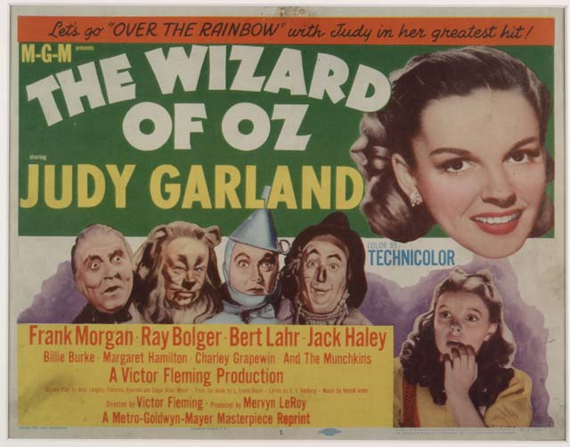

# Report with Interactive Images (Using Lightbox)

# Bells and Whistles 

## Displaying images 

Tips on dealing with displaying images in a rendered quarto document: <https://quarto.org/docs/authoring/figures.html#figure-panels>

We can lay out images a couple different ways, but one of the easiest is: 

```
::: {layout-ncol="2"}

{group="my-gallery"}

{group="my-gallery"}

{group="my-gallery"}

{group="my-gallery"}

:::
```

Alternatively, we can render plots from code into organized columns as well: 

````
```{python}
#| layout-ncol:2

# Create both plots here
```
````

## Interactive images (lightbox)

The Quarto Lightbox extension can be added with: 

```bash
quarto add quarto-ext/lightbox
```

It comes bundled with Quarto now though, woohoo!

One can also copy the extension from an existing project and link to the necessary files: 

```
title: "Quarto matplotlib and lightbox demo"
filters:
   - lightbox
lightbox: auto
format:
  html:
    code-fold: true
jupyter: python3
resource_files:
- "_extensions/quarto-ext/lightbox/lightbox.lua"
- "_extensions/quarto-ext/lightbox/lightbox.css"
- "_extensions/quarto-ext/lightbox/_extension.yml"
- "_extensions/quarto-ext/lightbox/resources/css/glightbox.min.css"
- "_extensions/quarto-ext/lightbox/resources/js/glightbox.min.js"
```


# For the developer

References: 

- <https://github.com/quarto-ext/lightbox> 
- <https://quarto.org/docs/projects/quarto-projects.html> 
- Tips on dealing with displaying images in a rendered quarto document: <https://quarto.org/docs/authoring/figures.html#figure-panels>
- Install the lightbox extension: <https://github.com/quarto-ext/lightbox>

Example also used in: <https://github.com/rstudio/posit-demo-assets/blob/main/Python/quarto-lightbox/quarto-python-lightbox.qmd> 


